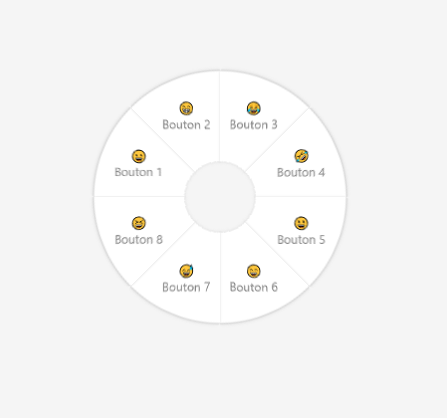

# Radial Menu

Radial Menu is a wrapper for making easelly radial menu. This menu will be opened by a right mouse click or a long touch on screen.

To select an item, release the right button or the finger on the button to select it.



[JSFiddle Sample](https://jsfiddle.net/L80pg3rd/1/)

```js
const config = {
    buttons: [
        {
            label:"😀<br>button 1",
            disabled:true
        }
        {,
            label:"😁<br>button 2"
        },
        {
            label:"😂<br>button 3"
        },
        {
            label:"🤣<br>button 4"
        },
        {
            label:"😃<br>button 5"
        },
        {
            label:"😄<br>button 6"
        },
        {
            label:"😅<br>button 7"
        },
        {
            label:"😆<br>button 8"
        }
    ],
    onSelect:function(index) { console.log(`Button ${index} selected`)}
};

const radial = new RadialMenu(config);
```

# TODO

- [x] Create HTML, CSS for menu
- [x] Create Class for creating new radial menu with simple config
- [ ] Make touch screen compatible
- [ ] Limit the minimal and maximal button due to the CSS limitation
- [ ] Create submenu
- [ ] Make possible to add/remove button on the way
- [ ] Animate the menu at open