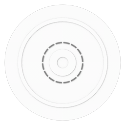

<p align="center">
  
</p>

Radial Menu is a wrapper for making easelly radial menu. This menu will be opened by a right mouse click or a long touch on screen.

To select an item, release the right button or the finger on the button to select it.


[JSFiddle Sample](https://jsfiddle.net/1z4fwedo/)

```js
const config = {
    parent:document.body,
    width:"384px",
    fontSize:"16px",
    buttons: [
        {
            label:"😀<br>button 1",
            disabled:true
        }
        {,
            label:"😁<br>button 2"
        },
        {
            label:"😂<br>button 3"
        },
        {
            label:"🤣<br>button 4"
        },
        {
            label:"😃<br>button 5"
        },
        {
            label:"😄<br>button 6"
        },
        {
            label:"😅<br>button 7"
        },
        {
            label:"😆<br>button 8"
        }
    ],
    onSelect:function(index, value) { 
        alert(`You've selected ${value}(${index}) !`) 
    }
};

const radial = new RadialMenu(config);
```

# TODO

- [x] Create HTML, CSS for menu
- [x] Create Class for creating new radial menu with simple config
- [x] Make touch screen compatible
- [x] Limit the minimal buttons due to the CSS limitation (no maximal, you know what you do !)
- [x] Make possible to add/update/remove buttons on the way
- [x] Create submenu

## Getting Started
### Installation
1. Clone the repo
   ```sh
   git clone https://github.com/lsza-dev/Radial-Menu.git
   ```
2. Add style.css and RadialMenu.js where you need it
   ```html
   <!DOCTYPE html>
    <html lang="en">
        <head>
            <meta charset="UTF-8">
            <meta name="viewport" content="width=device-width, initial-scale=1.0">
            <!-- Insert style.css -->
            <link rel="stylesheet" href="style.css">
            <title>Document</title>
        </head>
        <body></body>
    </html>
    <!-- Add RadialMenu.js -->
    <script src="RadialMenu.js"></script>
   ```
3. You're done and can create a new instance !
   ```js
   const config = {
    buttons:[{label:"my first button"}]
   };
   const radial = new RadialMenu(config);
   ```

## API
- **RadialMenu**
    - ### **[Class: `RadialMenu`](#class-radialmenu)**
        - **Properties**
            - [`config`](#prop-config)
                - [`buttons`](#config-buttons)
                    - [`label`](#config-buttons-label)
                    - [`value`](#config-buttons-value)
                    - [`buttons`](#config-buttons-buttons)
                    - [`color`](#config-buttons-color)
                    - [`disabled`](#config-button-disabled)
                    - [`hidden`](#config-button-hidden)
                - [`parent`](#config-parent)
                - [`width`](#config-width)
                - [`fontSize`](#config-fontSize)
                - [`onSelect`](#config-onSelect)
            - [`menus`](#prop-menus)
            - [`isOpen`](#prop-isOpen)
        - **Methods**
            - [`RadialMenu.onClose()`](#RadialMenu-onClose)
            - [`RadialMenu.onOpen()`](#RadialMenu-onOpen)
            - [`RadialMenu.onOpenSubMenu(button)`](#RadialMenu-onOpenSubMenu--button)
            - [`RadialMenu.onSelectedButton(button)`](#RadialMenu-onSelectedButton--button)
    - ### **[Class: `Radial`](#class-radial)**
        - **Properties**
            - [`config`](#prop-config)
                - [`buttons`](#config-buttons)
            - [`instance`](#prop-radial-instance)
            - [`radial`](#prop-radial-radial)
            - [`value`](#prop-radial-value)
        - **Methods**
            - [`Radial.generateRadialMenu()`](#radial-generateRadialMenu)
    - ### **[Class: `RadialButton`](#class-RadialButton)**
        - **Properties**
            - [`config`](#prop-config)
                - [`label`](#config-buttons-label)
                - [`value`](#config-buttons-value)
                - [`buttons`](#config-buttons-buttons)
                - [`color`](#config-buttons-color)
                - [`disabled`](#config-button-disabled)
                - [`hidden`](#config-button-hidden)
            - [`index`](#prop-radialButton-index)
            - [`instance`](#prop-radial-instance)
        - **Methods**
            - [`Radial.generateRadialMenu()`](#radial-generateRadialMenu)
            